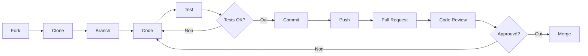

# 🤝 Guide de Contribution - Homebox_AI

Merci de votre intérêt pour contribuer à **Homebox_AI** ! Toute contribution est la bienvenue, que ce soit pour corriger des bugs, ajouter des fonctionnalités, ou améliorer la documentation.

## 📋 Table des Matières

- [Code de Conduite](#code-de-conduite)
- [Comment Contribuer](#comment-contribuer)
- [Rapporter un Bug](#rapporter-un-bug)
- [Proposer une Fonctionnalité](#proposer-une-fonctionnalité)
- [Processus de Pull Request](#processus-de-pull-request)
- [Standards de Code](#standards-de-code)
- [Structure du Projet](#structure-du-projet)
- [Tests](#tests)

-----

## 📜 Code de Conduite

Ce projet adhère à un code de conduite. En participant, vous vous engagez à respecter ce code. Voici les principes de base :

- 🤗 Soyez respectueux et inclusif
- 💬 Communiquez de manière constructive
- 🎯 Restez concentré sur les objectifs du projet
- 🚫 Évitez tout comportement inapproprié ou offensant

-----

## 🛠️ Comment Contribuer

### Types de Contributions

Nous acceptons différents types de contributions :

1. **🐛 Corrections de bugs**
1. **✨ Nouvelles fonctionnalités**
1. **📝 Amélioration de la documentation**
1. **🧪 Ajout de tests**
1. **🎨 Améliorations UI/UX**
1. **⚡ Optimisations de performance**
1. **🔐 Améliorations de sécurité**

### Avant de Commencer

1. **Vérifiez les Issues existantes** pour éviter les doublons
1. **Créez une Issue** pour discuter des changements majeurs
1. **Fork le repository** sur votre compte GitHub
1. **Clonez votre fork** localement
1. **Créez une branche** pour votre contribution

-----

## 🐛 Rapporter un Bug

Un bon rapport de bug doit contenir :

### Template de Bug Report

```markdown
**Description du bug**
Une description claire et concise du bug.

**Reproduction**
Étapes pour reproduire le comportement :
1. Aller à '...'
2. Cliquer sur '...'
3. Faire défiler jusqu'à '...'
4. Le bug apparaît

**Comportement attendu**
Ce qui devrait se passer normalement.

**Captures d'écran**
Si applicable, ajoutez des captures d'écran.

**Environnement**
- OS: [ex: Ubuntu 22.04]
- Version Docker: [ex: 24.0.5]
- Version du projet: [ex: v1.0.0]

**Logs**
Joindre les logs pertinents (masquer les données sensibles).

**Informations supplémentaires**
Tout autre contexte pertinent.
```

### Labels pour les Issues

- `bug` : Quelque chose ne fonctionne pas
- `enhancement` : Nouvelle fonctionnalité ou amélioration
- `documentation` : Amélioration de la documentation
- `good first issue` : Bon pour les débutants
- `help wanted` : Aide externe souhaitée
- `security` : Problème de sécurité
- `performance` : Problème de performance

-----

## 💡 Proposer une Fonctionnalité

### Template de Feature Request

```markdown
**Problème à résoudre**
Décrivez le problème que cette fonctionnalité résoudrait.

**Solution proposée**
Description claire de ce que vous souhaitez.

**Alternatives considérées**
Autres solutions ou fonctionnalités envisagées.

**Contexte additionnel**
Screenshots, mockups, références, etc.

**Impact**
- Utilisateurs affectés: [Tous / Avancés / Débutants]
- Complexité estimée: [Faible / Moyenne / Élevée]
- Priorité suggérée: [Faible / Moyenne / Haute]
```

-----

## 🔄 Processus de Pull Request

### 1. Préparer votre Environnement

```bash
# Fork et cloner
git clone https://github.com/VOTRE_USERNAME/Homebox_AI.git
cd Homebox_AI

# Ajouter l'upstream
git remote add upstream https://github.com/enabeteleazar/Homebox_AI.git

# Créer une branche
git checkout -b feature/ma-nouvelle-fonctionnalite
```

### 2. Développer

- Écrivez du code propre et commenté
- Suivez les standards de code (voir ci-dessous)
- Testez vos changements localement
- Commitez régulièrement avec des messages clairs

### 3. Tester

```bash
# Tester le démarrage des services
./start.sh

# Vérifier le statut
./status.sh

# Vérifier les logs
docker compose logs -f

# Tester les scripts modifiés
./Scripts/votre_script.sh
```

### 4. Soumettre la Pull Request

```bash
# Synchroniser avec upstream
git fetch upstream
git rebase upstream/master

# Pousser vers votre fork
git push origin feature/ma-nouvelle-fonctionnalite
```

Ensuite, créez la PR sur GitHub avec :

**Template de Pull Request :**

```markdown
## Description
Résumé des changements et motivation.

## Type de changement
- [ ] Bug fix (changement non-breaking qui corrige un problème)
- [ ] Nouvelle fonctionnalité (changement non-breaking qui ajoute une fonctionnalité)
- [ ] Breaking change (correction ou fonctionnalité qui impacterait les fonctionnalités existantes)
- [ ] Documentation

## Checklist
- [ ] Mon code suit les standards du projet
- [ ] J'ai effectué une auto-revue de mon code
- [ ] J'ai commenté mon code, particulièrement dans les zones complexes
- [ ] J'ai mis à jour la documentation
- [ ] Mes changements ne génèrent pas de nouveaux warnings
- [ ] J'ai testé localement et tout fonctionne
- [ ] Les tests existants passent toujours

## Tests effectués
Décrivez les tests que vous avez effectués.

## Screenshots (si applicable)
Ajoutez des captures d'écran si pertinent.

## Issues liées
Fixes #(numéro d'issue)
```

### 5. Revue de Code

- Soyez ouvert aux commentaires
- Répondez aux questions
- Effectuez les modifications demandées
- Une fois approuvée, votre PR sera mergée !

-----

## 📐 Standards de Code

### Shell Scripts (Bash)

```bash
#!/bin/bash
# Description: Brève description du script
# Auteur: Votre nom
# Date: YYYY-MM-DD

set -euo pipefail  # Exit on error, undefined vars, pipe failures

# === VARIABLES GLOBALES ===
VARIABLE_NAME="valeur"

# === FONCTIONS ===
function_name() {
    local local_var="$1"
    
    # Commentaires pour logique complexe
    echo "Action effectuée"
}

# === MAIN ===
function_name "argument"
```

**Règles :**

- Utiliser `set -euo pipefail` pour la sécurité
- Nommer les variables en MAJUSCULES pour les globales
- Commenter les sections complexes
- Indentation avec 4 espaces
- Vérifier les arguments avant utilisation

### Docker Compose

```yaml
services:
  service-name:
    image: image:tag
    container_name: nom_explicite
    restart: unless-stopped
    security_opt:
      - no-new-privileges:true
    environment:
      - VAR_NAME=${VAR_NAME}
    volumes:
      - ${PATH}/data:/data
    ports:
      - "${PORT}:8080"
    networks:
      - Homebox_Network
```

**Règles :**

- Utiliser des variables d’environnement pour les configs
- Toujours définir `restart: unless-stopped`
- Ajouter `security_opt` pour la sécurité
- Nommer explicitement les containers
- Documenter les ports exposés

### Python (si applicable)

```python
"""
Module description.

Author: Your name
Date: YYYY-MM-DD
"""

import os
import sys

# Constants
CONSTANT_NAME = "value"

def function_name(param: str) -> bool:
    """
    Function description.
    
    Args:
        param: Parameter description
        
    Returns:
        Description of return value
    """
    # Implementation
    return True

if __name__ == "__main__":
    # Main execution
    pass
```

**Règles :**

- Suivre PEP 8
- Utiliser des docstrings
- Type hints pour les fonctions
- Noms de variables descriptifs

### Documentation (Markdown)

- Utiliser des emojis de manière cohérente (🎯 📊 ⚙️ etc.)
- Structurer avec des headers hiérarchiques
- Ajouter des exemples de code
- Inclure des commandes complètes et testées
- Lier vers les ressources externes

-----

## 🏗️ Structure du Projet

```
Homebox_AI/
├── docker-compose.yaml       # Configuration principale
├── .env.example              # Template de configuration
├── README.md                 # Documentation principale
├── CONTRIBUTING.md           # Ce fichier
├── LICENSE                   # Licence MIT
│
├── Scripts/                  # Scripts utilitaires
│   ├── start.sh             # Démarrage système
│   ├── stop.sh              # Arrêt système
│   ├── status.sh            # Vérification état
│   ├── update_System.sh     # Mises à jour
│   ├── Homebox_Backup.sh    # Sauvegarde
│   └── docker-cleaner-auto.sh # Nettoyage
│
├── Services/                 # Configurations services
│   ├── Core/                # Services essentiels
│   ├── Automation/          # Services automatisation
│   └── Monitoring/          # Services monitoring
│
└── Data/                     # Données persistantes (gitignored)
```

### Où Ajouter Quoi ?

- **Nouveau service** → Ajouter dans `docker-compose.yaml` et créer dossier dans `Services/`
- **Nouveau script** → Ajouter dans `Scripts/` avec permissions exécution
- **Documentation** → Mettre à jour `README.md` ou créer fichier dans `docs/`
- **Configuration** → Ajouter variables dans `.env.example`

-----

## 🧪 Tests

### Tests Manuels Requis

Avant de soumettre une PR, testez :

1. **Démarrage complet**
   
   ```bash
   ./start.sh
   # Vérifier que tous les services démarrent
   ```
1. **Accès aux interfaces**
- Vérifier que chaque service web est accessible
- Tester les identifiants par défaut
1. **Logs sans erreurs**
   
   ```bash
   docker compose logs -f
   # Pas d'erreurs critiques
   ```
1. **Scripts utilitaires**
   
   ```bash
   ./status.sh
   ./stop.sh
   ./Scripts/docker-cleaner-auto.sh
   ```
1. **Mise à jour**
   
   ```bash
   ./Scripts/update_System.sh
   # Vérifier que tout se met à jour correctement
   ```

### Tests pour Nouveaux Scripts

Si vous ajoutez un nouveau script :

```bash
# Test de syntaxe
bash -n votre_script.sh

# Test ShellCheck (installer avec: apt install shellcheck)
shellcheck votre_script.sh

# Test d'exécution en dry-run si possible
./votre_script.sh --dry-run
```

-----

## 📊 Workflow de Développement



-----

## 🎯 Priorités Actuelles

Consultez les [Issues avec label “help wanted”](https://github.com/enabeteleazar/Homebox_AI/labels/help%20wanted) pour voir où l’aide est la plus nécessaire.

**Domaines prioritaires :**

- 📝 Amélioration de la documentation
- 🐛 Correction des bugs connus
- 🧪 Ajout de tests automatisés
- 🔐 Amélioration de la sécurité
- 📊 Dashboards Grafana pré-configurés
- 🤖 Intégration d’IA (Ollama, LLM)

-----

## 💬 Communication

- **Issues GitHub** : Pour bugs, questions et features
- **Discussions GitHub** : Pour les discussions générales
- **Pull Requests** : Pour proposer des changements

-----

## 🏆 Reconnaissance

Tous les contributeurs seront ajoutés à la section “Contributors” du README. Merci pour vos contributions ! 🙏

-----

## ❓ Questions ?

Si vous avez des questions sur le processus de contribution :

1. Consultez d’abord le [README](README.md)
1. Cherchez dans les [Issues existantes](https://github.com/enabeteleazar/Homebox_AI/issues)
1. Créez une nouvelle Issue avec le label `question`

-----

**Merci de contribuer à Homebox_AI ! 🎉**
